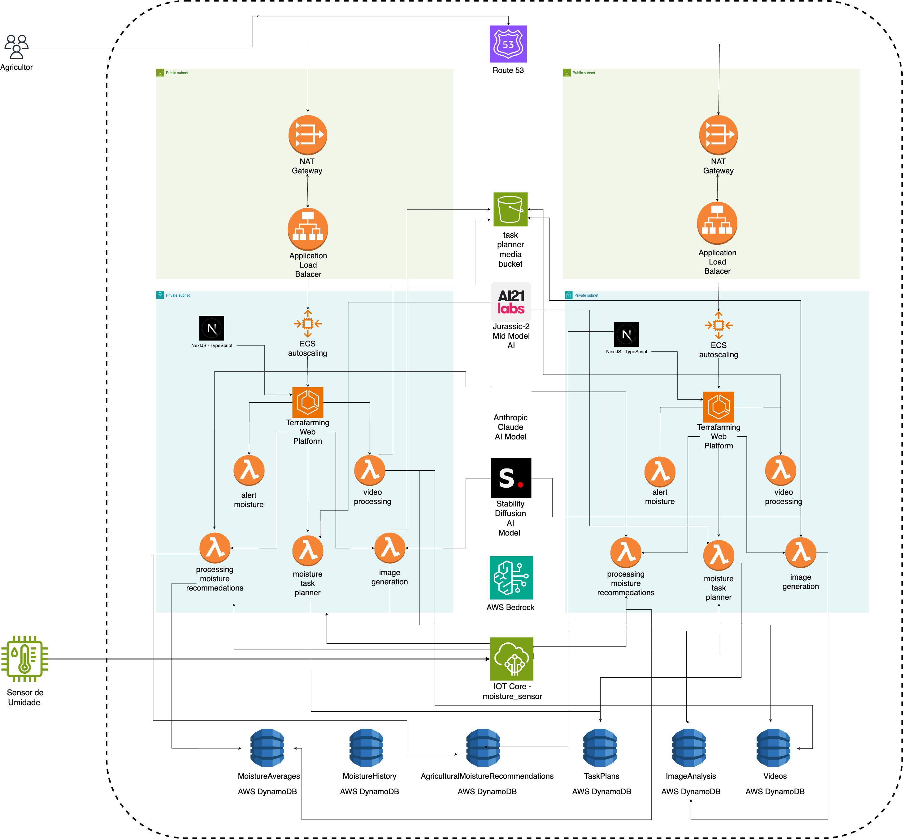

<<<<<<< HEAD
# tech4parking Application
=======
# Documentação da Soluçao Cloud para o Projeto TerraFarming
>>>>>>> df74ba0e66d4062408e34100d2aad18eb6abf17f

# Visão Geral\
O TerraFarming é um sistema de agricultura inteligente que utiliza IoT, análise de dados e inteligência artificial para otimizar as práticas agrícolas. O sistema coleta dados de sensores de umidade do solo, processa imagens e vídeos armazenados, e fornece recomendações personalizadas para os agricultores através de uma aplicação web moderna.

<<<<<<< HEAD
Este repositório contém o código para os microserviços e funções Lambda do aplicativo tech4parking, junto com a configuração da infraestrutura AWS usando Terraform. O tech4parking é um aplicativo de agricultura inteligente que utiliza inteligência artificial para fornecer recomendações aos agricultores com base em métricas do solo e condições climáticas.
=======
# Arquitetura na AWS\

>>>>>>> df74ba0e66d4062408e34100d2aad18eb6abf17f

Componentes Principais

1.  AWS IoT Core
2.  Amazon S3
3.  AWS Lambda
4.  Amazon DynamoDB
5.  Amazon Bedrock
6.  Amazon CloudWatch
7.  Amazon ECS (Elastic Container Service)
8.  Amazon ECR (Elastic Container Registry)
9.  Elastic Load Balancing
10. Amazon Route 53
11. AWS Certificate Manager (ACM)

Detalhamento dos Componentes

1.  AWS IoT Core

-   Gerencia a conexão dos sensores de umidade do solo
-   Configurado para receber leituras de umidade em intervalos específicos:
    -   Coleta 10 leituras de umidade consecutivas
    -   Calcula a média dessas 10 leituras
    -   Envia a média para processamento
    -   Aguarda por duas horas antes de iniciar o próximo ciclo de leituras (se configurado assim pelo agricultor)

Regras do IoT Core:

-   UmidadeMediaRule
    -   Trigger: Recebimento da média de umidade após 10 leituras
    -   Ação: Encaminha os dados para processamento via Lambda
-   ConfiguracaoLeituraRule
    -   Permite que o agricultor configure o intervalo entre os ciclos de leitura (padrão de 2 horas)

1.  Amazon S3

-   Bucket para armazenamento de imagens e vídeos capturados no campo
-   Bucket separado para armazenamento de dados processados e resultados de análises

1.  AWS Lambda Functions

-   moisture_lambda
    -   Trigger: IoT Core (UmidadeMediaRule)
    -   Função: Processa os dados de umidade e atualiza o DynamoDB
    -   Integrações: DynamoDB, Bedrock (para recomendações)
-   task_planning_lambda
    -   Trigger: CloudWatch Events (agendado)
    -   Função: Gera planos de tarefas baseados nos dados de umidade e recomendações
    -   Integrações: DynamoDB, Bedrock
-   alert_lambda
    -   Trigger: DynamoDB Streams (MoistureAverages)
    -   Função: Envia alertas baseados em condições críticas de umidade
    -   Integrações: SNS
-   image_generation_lambda
    -   Trigger: Diversos eventos (novos dados no DynamoDB, solicitações da aplicação web, etc.)
    -   Função: Gera imagens personalizadas baseadas nos dados agrícolas
    -   Integrações: DynamoDB (para leitura de dados), S3 (para armazenamento das imagens geradas)
-   video_processing_lambda
    -   Trigger: S3 (quando novos vídeos são carregados)
    -   Função: Processa vídeos armazenados no S3 e atualiza o DynamoDB
    -   Integrações: DynamoDB, Bedrock (para análise de vídeo)

1.  Amazon DynamoDB

-   MoistureHistory: Armazena histórico de leituras de umidade
-   MoistureAverages: Armazena médias de umidade calculadas
-   TaskPlans: Armazena planos de tarefas gerados
-   ImageAnalysis: Armazena resultados de análises de imagens
-   Videos: Armazena metadados e URLs de vídeos processados

1.  Amazon Bedrock\
    O Amazon Bedrock é utilizado para análises avançadas e geração de recomendações personalizadas. Três modelos são empregados:

-   Claude
    -   Uso: Geração de recomendações detalhadas e análise de texto complexo
    -   Aplicações: Elaboração de planos de tarefas, interpretação de dados de sensores
-   Jurassic Mid
    -   Uso: Processamento de linguagem natural e geração de texto
    -   Aplicações: Criação de resumos de dados, geração de alertas contextualizados
-   Stable Diffusion
    -   Uso: Análise e geração de imagens
    -   Aplicações: Processamento de imagens do campo, detecção de problemas nas plantações

1.  Amazon CloudWatch

-   Monitoramento de todos os componentes do sistema
-   Configuração de alarmes para condições críticas

1.  Amazon ECS (Elastic Container Service)

-   Hospeda a aplicação web do TerraFarming
-   Gerencia os containers Docker da aplicação
-   Configurado com auto-scaling para lidar com variações de carga

1.  Amazon ECR (Elastic Container Registry)

-   Armazena as imagens Docker da aplicação web

1.  Elastic Load Balancing

-   Distribui o tráfego entre os containers da aplicação web
-   Garante alta disponibilidade e escalabilidade

1.  Amazon Route 53

-   Gerencia o DNS para o domínio da aplicação web

1.  AWS Certificate Manager (ACM)

-   Fornece e gerencia o certificado SSL/TLS para a aplicação web

1.  Geração de Imagens com AWS Lambda\
    Em vez de usar um serviço externo para análise de imagens, implementamos uma solução personalizada de geração de imagens usando AWS Lambda. Esta abordagem nos permite criar visualizações específicas baseadas nos dados coletados.

image_generation_lambda:

-   Trigger: Pode ser acionada por eventos diversos (novos dados no DynamoDB, solicitações da aplicação web, etc.)
-   Função: Gera imagens personalizadas baseadas nos dados agrícolas
-   Integrações: DynamoDB (para leitura de dados), S3 (para armazenamento das imagens geradas)

A função utiliza bibliotecas Python como Pillow ou Matplotlib para criar visualizações como:

-   Mapas de calor de umidade do solo
-   Gráficos de crescimento das plantas
-   Visualizações de distribuição de nutrientes

Arquitetura do Sistema

json

Copiar

```
[IoT Devices] --> [IoT Core] --> [Lambda Functions] --> [DynamoDB]
                                       |
                                       v
[S3 (Raw Data)] --> [Lambda] --> [image_generation_lambda] --> [S3 (Generated Images)]
[S3 (Videos)] --> [Lambda Functions] --> [Bedrock] --> [DynamoDB]
                                |
                                |
                                v
                        [ECS (Web App)] <----> [Lambda Functions]
                             |
                             v
              [Load Balancer] <---> [Route 53]
                                         |
                                         v
                                   [ACM Certificate]

```

Fluxo de Dados

1.  Fluxo de Dados de Umidade

-   O sensor de umidade do solo realiza 10 leituras consecutivas.
-   O dispositivo IoT calcula a média dessas 10 leituras.
-   A média é enviada para o AWS IoT Core.
-   O IoT Core aciona a regra UmidadeMediaRule.
-   A regra aciona a moisture_lambda.
-   A moisture_lambda processa os dados e os armazena no DynamoDB (tabela MoistureHistory).
-   Após o envio, o dispositivo IoT aguarda pelo intervalo configurado (padrão de 2 horas) antes de iniciar o próximo ciclo de leituras.

1.  Fluxo de Geração de Imagens

-   Um evento (como novos dados de umidade) aciona a image_generation_lambda.
-   A função Lambda recupera os dados necessários do DynamoDB.
-   Utilizando bibliotecas de geração de imagens, a função cria a visualização apropriada.
-   A imagem gerada é salva no bucket S3 designado.
-   O URL da imagem e metadados são armazenados no DynamoDB para referência futura.

1.  Fluxo de Processamento de Vídeo

-   Os vídeos são carregados manualmente no bucket S3 designado.
-   O carregamento de novos arquivos aciona a função video_processing_lambda.
-   A video_processing_lambda processa os vídeos, utilizando os modelos do Amazon Bedrock conforme necessário.
-   Os resultados da análise são armazenados no DynamoDB.
-   Metadata e URLs dos vídeos processados são armazenados na tabela Videos do DynamoDB.

Aplicação Web\
A aplicação web do TerraFarming é desenvolvida utilizando:

-   NextJS: Framework React para renderização do lado do servidor e geração de sites estáticos
-   TypeScript: Superset tipado de JavaScript para desenvolvimento mais seguro e eficiente

Infraestrutura da Aplicação Web

-   ECS: Hospeda os containers Docker da aplicação
-   ECR: Armazena as imagens Docker da aplicação
-   Load Balancer: Distribui o tráfego entre as instâncias da aplicação
-   Auto Scaling: Ajusta automaticamente o número de containers com base na demanda
-   Route 53: Gerencia o DNS do domínio da aplicação
-   ACM: Fornece o certificado SSL/TLS para conexões seguras

Provisionamento com Terraform\
[Esta seção permanece a mesma da versão anterior, com adições para ECS, ECR, Load Balancer, Route 53 e ACM]

Considerações Futuras

-   Implementação de câmeras IoT para captura automática de imagens e vídeos do campo
-   Expansão das capacidades de análise de imagem usando modelos mais avançados do Bedrock
-   Desenvolvimento de funcionalidades de machine learning personalizadas para detecção de padrões específicos nas culturas
-   Implementação de um sistema de feedback do agricultor para melhorar continuamente as recomendações geradas pelos modelos de IA
-   Implementação de análise de séries temporais para comparar imagens da mesma área ao longo do tempo, detectando mudanças nas culturas
-   Exploração de técnicas avançadas de processamento de imagem para melhorar a qualidade e utilidade das visualizações geradas

<<<<<<< HEAD
#### Endpoints

-   `POST /crop-health`: Adiciona informações de saúde da colheita.
-   `GET /crop-health/{id}`: Obtém informações de saúde da colheita.
-   `PUT /crop-health/{id}`: Atualiza informações de saúde da colheita.
-   `DELETE /crop-health/{id}`: Deleta informações de saúde da colheita.

### Equipment Health Service

O `equipment-health-service` gerencia a saúde dos equipamentos agrícolas.

#### Endpoints

-   `POST /equipment-health`: Adiciona informações de saúde dos equipamentos.
-   `GET /equipment-health/{id}`: Obtém informações de saúde dos equipamentos.
-   `PUT /equipment-health/{id}`: Atualiza informações de saúde dos equipamentos.
-   `DELETE /equipment-health/{id}`: Deleta informações de saúde dos equipamentos.

### Weather Service

O `weather-service` fornece informações climáticas e previsões.

#### Endpoints

-   `GET /weather/current`: Obtém informações climáticas atuais.
-   `GET /weather/forecast`: Obtém previsões climáticas.

### Greenhouse Service

O `greenhouse-service` gerencia informações das estufas.

#### Endpoints

-   `POST /greenhouse`: Adiciona uma nova estufa.
-   `GET /greenhouse/{id}`: Obtém informações de uma estufa.
-   `PUT /greenhouse/{id}`: Atualiza informações de uma estufa.
-   `DELETE /greenhouse/{id}`: Deleta uma estufa.


Funções Lambda
--------------

### Image Analysis

A função `image-analysis` utiliza o Amazon Rekognition para analisar imagens e fornecer métricas.

### Weather Recommendation

A função `weather-recommendation` fornece recomendações com base nas condições climáticas e métricas do solo.

Diagramas de Rede
--------------------------

### Diagramas de Rede (High-Level)

-   **Subnets Públicas**:

    -   NAT Gateway
    -   Load Balancer (se aplicável)
-   **Subnets Privadas**:

    -   Todos os microserviços (Farmer Service, Soil Metrics Service, Crop Health Service, Equipment Health Service, Weather Service, Greenhouse Service)
    -   Lambdas (Weather Recommendations, Soil Metrics Recommendations)
    -   Banco de Dados (por exemplo, DynamoDB, RDS)


Comunicação entre serviços
--------------------------

### Comunicações e Fluxo de Eventos

Para um sistema que utiliza microserviços e funções Lambda com EventBridge, a comunicação entre os serviços pode ser visualizada como um fluxo de eventos. Cada serviço publica eventos ao realizar certas ações, e outros serviços ou funções Lambda podem ser configurados para escutar esses eventos e reagir a eles.


#### 1\. Farmer Service

-   **Publica**: `FarmerUpdate`
-   **Consumidores**:
    -   **Soil Metrics Service**: Pode escutar atualizações de informações do agricultor para ajustar as métricas de solo associadas.
    -   **Weather Service**: Pode escutar atualizações de informações do agricultor para fornecer previsões de clima mais precisas baseadas na localização.

#### 2\. Soil Metrics Service

-   **Publica**: `SoilMetricsUpdate`
-   **Consumidores**:
    -   **Crop Health Service**: Pode usar as atualizações das métricas do solo para ajustar as recomendações de saúde das plantações.
    -   **Equipment Health Service**: Pode ajustar a manutenção dos equipamentos baseada nas condições do solo.

#### 3\. Crop Health Service

-   **Publica**: `CropHealthUpdate`
-   **Consumidores**:
    -   **Farmer Service**: Pode notificar os agricultores sobre o estado atual das plantações e recomendações.
    -   **Greenhouse Service**: Pode ajustar as condições da estufa para otimizar a saúde das plantas.

#### 4\. Equipment Health Service

-   **Publica**: `EquipmentHealthUpdate`
-   **Consumidores**:
    -   **Farmer Service**: Pode notificar os agricultores sobre o estado atual dos equipamentos e recomendações de manutenção.
    -   **Soil Metrics Service**: Pode ajustar as métricas do solo considerando o desempenho dos equipamentos.

#### 5\. Weather Service

-   **Publica**: `WeatherUpdate`
-   **Consumidores**:
    -   **Weather Recommendation Lambda**: Pode gerar recomendações baseadas nas previsões do clima.
    -   **Crop Health Service**: Pode ajustar as recomendações de saúde das plantações considerando as previsões climáticas.

#### 6\. Greenhouse Service

-   **Publica**: `GreenhouseUpdate`
-   **Consumidores**:
    -   **Farmer Service**: Pode notificar os agricultores sobre as condições atuais da estufa e recomendações.

#### 7\. Funções Lambda

-   **Image Analysis Lambda**
    -   **Publica**: `ImageAnalyzed`
    -   **Consumidores**:
        -   **Crop Health Service**: Pode ajustar as recomendações de saúde das plantações baseadas na análise de imagens.
-   **Weather Recommendation Lambda**
    -   **Publica**: `WeatherRecommendation`
    -   **Consumidores**:
        -   **Farmer Service**: Pode notificar os agricultores sobre as recomendações baseadas no clima.

### Fluxo de Comunicação

#### Exemplo de Fluxo de Comunicação

1.  **Farmer Service** atualiza as informações do agricultor e publica um evento `FarmerUpdate`.
2.  **Soil Metrics Service** e **Weather Service** escutam o evento `FarmerUpdate` e atualizam suas próprias informações.
3.  **Soil Metrics Service** publica um evento `SoilMetricsUpdate`.
4.  **Crop Health Service** escuta o evento `SoilMetricsUpdate` e ajusta suas recomendações de saúde das plantações, publicando um evento `CropHealthUpdate`.
5.  **Farmer Service** escuta o evento `CropHealthUpdate` e notifica o agricultor sobre as novas recomendações.
6.  **Weather Service** publica um evento `WeatherUpdate`.
7.  **Weather Recommendation Lambda** escuta o evento `WeatherUpdate`, processa as informações e publica um evento `WeatherRecommendation`.
8.  **Farmer Service** escuta o evento `WeatherRecommendation` e notifica o agricultor sobre as novas recomendações baseadas no clima.


Conceitos Utilizados
--------------------

### SOLID

Os princípios SOLID foram aplicados para garantir que os microserviços sejam bem projetados e manteníveis:

-   **Single Responsibility Principle (SRP)**: Cada classe tem uma única responsabilidade.
-   **Open/Closed Principle (OCP)**: As classes estão abertas para extensão, mas fechadas para modificação.
-   **Liskov Substitution Principle (LSP)**: As subclasses podem ser substituídas por suas classes base.
-   **Interface Segregation Principle (ISP)**: Muitas interfaces específicas são melhores do que uma interface única.
-   **Dependency Inversion Principle (DIP)**: Dependa de abstrações, não de implementações concretas.

### Linguagem e Tecnologias

-   **Linguagem**: Python
-   **Infraestrutura**: AWS (ECS, ECR, Lambda, Terraform)
-   **Bibliotecas de IA**: Amazon Rekognition, Amazon Bedrock e Amazon SageMaker


Armazenamento de imagens e outros objetos
-----------------------------------------

### Estrutura de Arquivos para S3

O Amazon S3 (Simple Storage Service) é um serviço de armazenamento em nuvem da AWS que permite armazenar e recuperar qualquer quantidade de dados a qualquer momento. Na infraestrutura que estamos desenvolvendo, o S3 será usado para armazenar imagens e dados brutos que precisam ser processados pelas funções Lambda e pelos microserviços.

#### 1\. Nome do Bucket: `tech4parking-metrics-data-storage`

#### 2\. Diretórios e Arquivos

`tech4parking-metrics-data-storage/
├── farmer_data/
│   ├── {farmer_id}/
│   │   ├── profile/
│   │   │   ├── profile_image.jpg
│   │   ├── soil_metrics/
│   │   │   ├── metrics_{timestamp}.json
│   │   ├── crop_health/
│   │   │   ├── image_{timestamp}.jpg
│   │   │   ├── analysis_{timestamp}.json
│   │   ├── equipment_health/
│   │   │   ├── image_{timestamp}.jpg
│   │   │   ├── analysis_{timestamp}.json
│   │   ├── greenhouse/
│   │   │   ├── metrics_{timestamp}.json
│   │   ├── weather/
│   │   │   ├── forecast_{timestamp}.json
│   │   │   ├── recommendation_{timestamp}.json
├── logs/
│   ├── {service_name}/
│   │   ├── log_{timestamp}.txt`


# Estrutura de configuração do S3 usando Terraform

## Visão geral

Esse diretório contém arquivos de configuração do Terraform e um script Python para gerenciar um bucket S3 usado em nosso aplicativo. O bucket S3 é usado principalmente para armazenar imagens e dados brutos que serão processados por funções Lambda e microsserviços.

## Estrutura do diretório

```plaintext
├─ services
│  ├── s3/
│  │  ├── upload_to_s3/
│  │  │   ├── app/
│  │  │   │   ├── main.py
│  │  │   │   ├── requirements.txt
│  │  │   ├── Dockerfile
terraform/
├── modules/
│   ├── ...
│   ├── storage
│   │   ├── outputs.tf
│   │   ├── S3_images_storage.tf
│   │   ├── variables.tf
└── README.md
```

Estrutura do banco de dados
------------------------------------

### Estrutura das Tabelas no DynamoDB

#### 1\. **Farmer Service**

Tabela: `Farmers`

plaintext

Copiar código

`Farmers
├── FarmerID (Partition Key)
├── Name
├── Email
├── PhoneNumber
├── Address`

#### 2\. **Soil Metrics Service**

Tabela: `SoilMetrics`

plaintext

Copiar código

`SoilMetrics
├── MetricID (Partition Key)
├── FarmerID (Sort Key)
├── Date
├── pHLevel
├── MoistureLevel
├── Temperature`

#### 3\. **Crop Health Service**

Tabela: `CropHealth`

plaintext

Copiar código

`CropHealth
├── CropID (Partition Key)
├── FarmerID (Sort Key)
├── Date
├── HealthStatus
├── ImageURL
├── AnalysisResult`

#### 4\. **Equipment Health Service**

Tabela: `EquipmentHealth`

plaintext

Copiar código

`EquipmentHealth
├── EquipmentID (Partition Key)
├── FarmerID (Sort Key)
├── Date
├── HealthStatus
├── Metrics`

#### 5\. **Weather Service**

Tabela: `WeatherData`

plaintext

Copiar código

`WeatherData
├── WeatherID (Partition Key)
├── Date
├── Temperature
├── Humidity
├── Precipitation
├── FarmerID (Sort Key)`

#### 6\. **Greenhouse Service**

Tabela: `GreenhouseData`

plaintext

Copiar código

`GreenhouseData
├── GreenhouseID (Partition Key)
├── FarmerID (Sort Key)
├── Date
├── Temperature
├── Humidity
├── CO2Level`

#### 7\. **Image Analysis Lambda**

Tabela: `ImageAnalysisResults`

plaintext

Copiar código

`ImageAnalysisResults
├── AnalysisID (Partition Key)
├── ImageURL
├── AnalysisDate
├── Result`

#### 8\. **Weather Recommendation Lambda**

Tabela: `WeatherRecommendations`

plaintext

Copiar código

`WeatherRecommendations
├── RecommendationID (Partition Key)
├── FarmerID (Sort Key)
├── Date
├── Recommendation`


Importância do S3 na infraestrutura
--------------------------------------

- **Armazenamento**: O S3 fornece uma solução de armazenamento dimensionável e durável para imagens e dados que precisam ser processados pelo nosso sistema.
- **Integração**: As imagens armazenadas podem ser acessadas diretamente por funções Lambda para análise, e os resultados podem ser armazenados novamente no S3 para processamento posterior.
- **Custo-benefício**: O S3 oferece uma maneira econômica de armazenar grandes quantidades de dados com alta disponibilidade e confiabilidade.

Ao usar o S3, garantimos que nosso aplicativo possa lidar com grandes volumes de dados de forma eficiente, dando suporte aos requisitos de processamento e análise do nosso aplicativo de agricultura inteligente.


### Explicação da Importância do S3 na Infraestrutura

- **Armazenamento**: O S3 fornece uma solução escalável e durável para armazenamento de imagens e dados que precisam ser processados pelo nosso sistema.
- **Integração**: As imagens armazenadas podem ser acessadas diretamente pelas funções Lambda para análise, e os resultados podem ser armazenados de volta no S3 para processamento posterior.
- **Custo-benefício**: O S3 oferece uma maneira econômica de armazenar grandes quantidades de dados com alta disponibilidade e confiabilidade.

Usando o S3, garantimos que nosso aplicativo possa lidar com grandes volumes de dados de forma eficiente, suportando os requisitos de processamento e análise do nosso aplicativo de agricultura inteligente.

### Finalidade do S3 na Infraestrutura

1.  **Armazenamento de Dados do Agricultor**:

    -   **Profile**: Imagens de perfil do agricultor.
    -   **Soil Metrics**: Arquivos JSON contendo métricas de solo coletadas em diferentes momentos.
    -   **Crop Health**: Imagens e análises das safras para verificar saúde e doenças.
    -   **Equipment Health**: Imagens e análises da saúde dos equipamentos agrícolas.
    -   **Greenhouse**: Métricas de estufas coletadas periodicamente.
    -   **Weather**: Previsões do tempo e recomendações baseadas nas condições meteorológicas.
2.  **Logs**:

    -   **Logs de Serviços**: Arquivos de log gerados por diferentes serviços para monitoramento e debugging.

### Utilização do S3 na Infraestrutura

1.  **Armazenamento de Imagens e Métricas**:

    -   As funções Lambda, como `ImageAnalyzed` e `WeatherRecommendation`, podem fazer upload de imagens e arquivos de métricas para o S3 após a análise.
2.  **Integração com Outros Serviços**:

    -   Os microserviços podem acessar os arquivos no S3 para processamento adicional ou para fornecer dados necessários para a tomada de decisões.
3.  **Monitoramento e Logging**:

    -   Logs gerados por serviços e funções Lambda são armazenados no S3, permitindo fácil acesso e análise.

### Exemplo de Código para Upload no S3 (Python)

`
import boto3
import os

s3_client = boto3.client('s3')

def upload_to_s3(file_path, bucket_name, s3_key):
    try:
        s3_client.upload_file(file_path, bucket_name, s3_key)
        print(f"File {file_path} uploaded to {bucket_name}/{s3_key}")
    except Exception as e:
        print(f"Error uploading file to S3: {str(e)}")

file_path = "path/to/your/file.jpg"
bucket_name = "tech4parking-metrics-data-storage"
s3_key = "farmer_data/12345/crop_health/image_20240705.jpg"

upload_to_s3(file_path, bucket_name, s3_key)
`

Script Python
-------------

-   **upload_images.py**: Um script Python que faz upload de imagens de um diretório local para o bucket do S3.

Usage
-----

### Configuração do bucket S3

1.  **Inicializar o Terraform**: Navegue até o diretório `terraform/` e execute:

    sh

    Copiar código

    `terraform init`

2.  **Aplicar a configuração do Terraform**: Aplique a configuração para criar o bucket S3:

    sh

    Copiar código

    `terraform apply`

### Uploading Images to S3

1.  **Instalar o Boto3**: Certifique-se de que você tenha o Boto3 instalado em seu ambiente Python:

    sh

    Copiar código

    `pip install boto3`

2.  **Execute o script de upload**: Execute o script `upload_images.py` para fazer upload de imagens para o bucket do S3:

    sh

    Copiar código

    `python upload_images.py`

Esta estrutura facilita o gerenciamento de dados e a integração entre diferentes componentes da aplicação, garantindo que todas as informações necessárias estejam centralizadas e acessíveis de forma eficiente.


Configuração e Implantação
--------------------------

### Pré-requisitos

-   Docker
-   AWS CLI configurado
-   Terraform instalado

### Instruções de Configuração

1.  Clone o repositório:

    sh

    Copiar código

    `git clone https://github.com/seu-usuario/tech4parking.git
    cd tech4parking`

2.  Configure suas credenciais AWS e inicialize o Terraform:

    sh

    Copiar código

    `cd terraform
    terraform init`

3.  Aplique a configuração do Terraform:

    sh

    Copiar código

    `terraform apply`

4.  Construa e envie as imagens Docker para o ECR:

    sh

    Copiar código

    `cd scripts
    ./build_and_push.sh`

### Executando os Microserviços

Cada microserviço pode ser executado localmente usando Docker Compose ou implantado no ECS conforme definido nos arquivos Terraform.

Contribuições
-------------

Contribuições são bem-vindas! Por favor, faça um fork do repositório e envie um pull request com suas alterações.

* * * * *

Este documento cobre a configuração inicial e a arquitetura do aplicativo tech4parking. Para mais detalhes sobre cada microserviço e função Lambda, consulte a documentação específica em cada diretório correspondente.
=======
Esta documentação atualizada reflete a arquitetura atual do projeto TerraFarming, incluindo o uso do Amazon Bedrock para IA, a geração de imagens personalizada com AWS Lambda, o processamento de vídeos armazenados no S3, e os detalhes da aplicação web hospedada no ECS.
>>>>>>> df74ba0e66d4062408e34100d2aad18eb6abf17f
