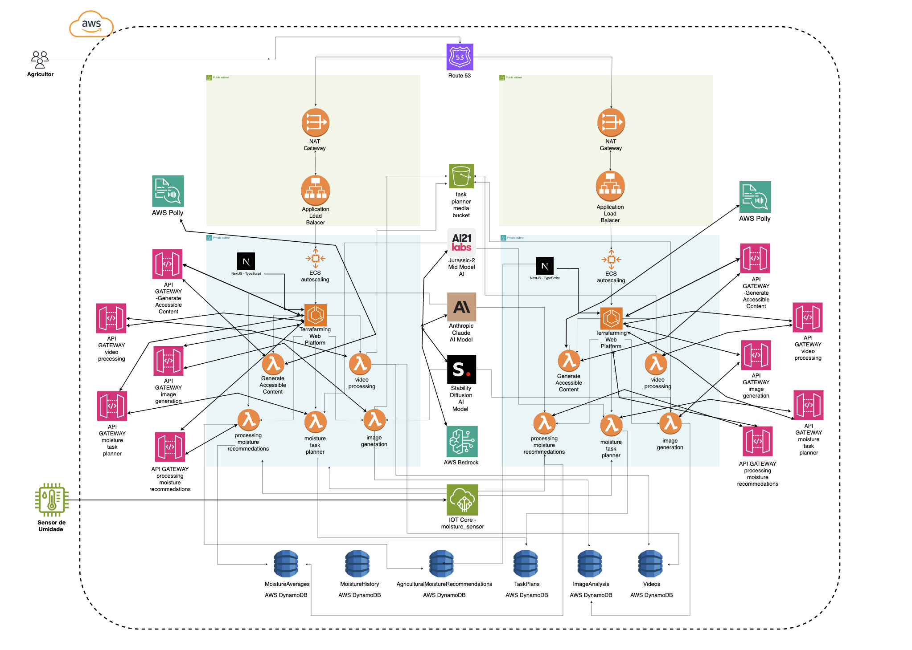

# Documentação da Soluçao Cloud para o Projeto TerraFarming

# Visão Geral\
O TerraFarming é um sistema de agricultura inteligente que utiliza IoT, análise de dados e inteligência artificial para otimizar as práticas agrícolas. O sistema coleta dados de sensores de umidade do solo, processa imagens e vídeos armazenados, e fornece recomendações personalizadas para os agricultores através de uma aplicação web moderna.

# Arquitetura na AWS\


Componentes Principais

1.  AWS IoT Core
2.  Amazon S3
3.  AWS Lambda
4.  Amazon DynamoDB
5.  Amazon Bedrock
6.  Amazon CloudWatch
7.  Amazon ECS (Elastic Container Service)
8.  Amazon ECR (Elastic Container Registry)
9.  Elastic Load Balancing
10. Amazon Route 53
11. AWS Certificate Manager (ACM)

Detalhamento dos Componentes

1.  AWS IoT Core

-   Gerencia a conexão dos sensores de umidade do solo
-   Configurado para receber leituras de umidade em intervalos específicos:
    -   Coleta 10 leituras de umidade consecutivas
    -   Calcula a média dessas 10 leituras
    -   Envia a média para processamento
    -   Aguarda por duas horas antes de iniciar o próximo ciclo de leituras (se configurado assim pelo agricultor)

Regras do IoT Core:

-   UmidadeMediaRule
    -   Trigger: Recebimento da média de umidade após 10 leituras
    -   Ação: Encaminha os dados para processamento via Lambda
-   ConfiguracaoLeituraRule
    -   Permite que o agricultor configure o intervalo entre os ciclos de leitura (padrão de 2 horas)

1.  Amazon S3

-   Bucket para armazenamento de imagens e vídeos capturados no campo
-   Bucket separado para armazenamento de dados processados e resultados de análises

1.  AWS Lambda Functions

-   moisture_lambda
    -   Trigger: IoT Core (UmidadeMediaRule)
    -   Função: Processa os dados de umidade e atualiza o DynamoDB
    -   Integrações: DynamoDB, Bedrock (para recomendações)
-   task_planning_lambda
    -   Trigger: CloudWatch Events (agendado)
    -   Função: Gera planos de tarefas baseados nos dados de umidade e recomendações
    -   Integrações: DynamoDB, Bedrock
-   alert_lambda
    -   Trigger: DynamoDB Streams (MoistureAverages)
    -   Função: Envia alertas baseados em condições críticas de umidade
    -   Integrações: SNS
-   image_generation_lambda
    -   Trigger: Diversos eventos (novos dados no DynamoDB, solicitações da aplicação web, etc.)
    -   Função: Gera imagens personalizadas baseadas nos dados agrícolas
    -   Integrações: DynamoDB (para leitura de dados), S3 (para armazenamento das imagens geradas)
-   video_processing_lambda
    -   Trigger: S3 (quando novos vídeos são carregados)
    -   Função: Processa vídeos armazenados no S3 e atualiza o DynamoDB
    -   Integrações: DynamoDB, Bedrock (para análise de vídeo)

1.  Amazon DynamoDB

-   MoistureHistory: Armazena histórico de leituras de umidade
-   MoistureAverages: Armazena médias de umidade calculadas
-   TaskPlans: Armazena planos de tarefas gerados
-   ImageAnalysis: Armazena resultados de análises de imagens
-   Videos: Armazena metadados e URLs de vídeos processados

1.  Amazon Bedrock\
    O Amazon Bedrock é utilizado para análises avançadas e geração de recomendações personalizadas. Três modelos são empregados:

-   Claude
    -   Uso: Geração de recomendações detalhadas e análise de texto complexo
    -   Aplicações: Elaboração de planos de tarefas, interpretação de dados de sensores
-   Jurassic Mid
    -   Uso: Processamento de linguagem natural e geração de texto
    -   Aplicações: Criação de resumos de dados, geração de alertas contextualizados
-   Stable Diffusion
    -   Uso: Análise e geração de imagens
    -   Aplicações: Processamento de imagens do campo, detecção de problemas nas plantações

1.  Amazon CloudWatch

-   Monitoramento de todos os componentes do sistema
-   Configuração de alarmes para condições críticas

1.  Amazon ECS (Elastic Container Service)

-   Hospeda a aplicação web do TerraFarming
-   Gerencia os containers Docker da aplicação
-   Configurado com auto-scaling para lidar com variações de carga

1.  Amazon ECR (Elastic Container Registry)

-   Armazena as imagens Docker da aplicação web

1.  Elastic Load Balancing

-   Distribui o tráfego entre os containers da aplicação web
-   Garante alta disponibilidade e escalabilidade

1.  Amazon Route 53

-   Gerencia o DNS para o domínio da aplicação web

1.  AWS Certificate Manager (ACM)

-   Fornece e gerencia o certificado SSL/TLS para a aplicação web

1.  Geração de Imagens com AWS Lambda\
    Em vez de usar um serviço externo para análise de imagens, implementamos uma solução personalizada de geração de imagens usando AWS Lambda. Esta abordagem nos permite criar visualizações específicas baseadas nos dados coletados.

image_generation_lambda:

-   Trigger: Pode ser acionada por eventos diversos (novos dados no DynamoDB, solicitações da aplicação web, etc.)
-   Função: Gera imagens personalizadas baseadas nos dados agrícolas
-   Integrações: DynamoDB (para leitura de dados), S3 (para armazenamento das imagens geradas)

A função utiliza bibliotecas Python como Pillow ou Matplotlib para criar visualizações como:

-   Mapas de calor de umidade do solo
-   Gráficos de crescimento das plantas
-   Visualizações de distribuição de nutrientes

Arquitetura do Sistema

json

Copiar

```
[IoT Devices] --> [IoT Core] --> [Lambda Functions] --> [DynamoDB]
                                       |
                                       v
[S3 (Raw Data)] --> [Lambda] --> [image_generation_lambda] --> [S3 (Generated Images)]
[S3 (Videos)] --> [Lambda Functions] --> [Bedrock] --> [DynamoDB]
                                |
                                |
                                v
                        [ECS (Web App)] <----> [Lambda Functions]
                             |
                             v
              [Load Balancer] <---> [Route 53]
                                         |
                                         v
                                   [ACM Certificate]

```

Fluxo de Dados

1.  Fluxo de Dados de Umidade

-   O sensor de umidade do solo realiza 10 leituras consecutivas.
-   O dispositivo IoT calcula a média dessas 10 leituras.
-   A média é enviada para o AWS IoT Core.
-   O IoT Core aciona a regra UmidadeMediaRule.
-   A regra aciona a moisture_lambda.
-   A moisture_lambda processa os dados e os armazena no DynamoDB (tabela MoistureHistory).
-   Após o envio, o dispositivo IoT aguarda pelo intervalo configurado (padrão de 2 horas) antes de iniciar o próximo ciclo de leituras.

1.  Fluxo de Geração de Imagens

-   Um evento (como novos dados de umidade) aciona a image_generation_lambda.
-   A função Lambda recupera os dados necessários do DynamoDB.
-   Utilizando bibliotecas de geração de imagens, a função cria a visualização apropriada.
-   A imagem gerada é salva no bucket S3 designado.
-   O URL da imagem e metadados são armazenados no DynamoDB para referência futura.

1.  Fluxo de Processamento de Vídeo

-   Os vídeos são carregados manualmente no bucket S3 designado.
-   O carregamento de novos arquivos aciona a função video_processing_lambda.
-   A video_processing_lambda processa os vídeos, utilizando os modelos do Amazon Bedrock conforme necessário.
-   Os resultados da análise são armazenados no DynamoDB.
-   Metadata e URLs dos vídeos processados são armazenados na tabela Videos do DynamoDB.

Aplicação Web\
A aplicação web do TerraFarming é desenvolvida utilizando:

-   NextJS: Framework React para renderização do lado do servidor e geração de sites estáticos
-   TypeScript: Superset tipado de JavaScript para desenvolvimento mais seguro e eficiente

Infraestrutura da Aplicação Web

-   ECS: Hospeda os containers Docker da aplicação
-   ECR: Armazena as imagens Docker da aplicação
-   Load Balancer: Distribui o tráfego entre as instâncias da aplicação
-   Auto Scaling: Ajusta automaticamente o número de containers com base na demanda
-   Route 53: Gerencia o DNS do domínio da aplicação
-   ACM: Fornece o certificado SSL/TLS para conexões seguras

Provisionamento com Terraform\
[Esta seção permanece a mesma da versão anterior, com adições para ECS, ECR, Load Balancer, Route 53 e ACM]

Considerações Futuras

-   Implementação de câmeras IoT para captura automática de imagens e vídeos do campo
-   Expansão das capacidades de análise de imagem usando modelos mais avançados do Bedrock
-   Desenvolvimento de funcionalidades de machine learning personalizadas para detecção de padrões específicos nas culturas
-   Implementação de um sistema de feedback do agricultor para melhorar continuamente as recomendações geradas pelos modelos de IA
-   Implementação de análise de séries temporais para comparar imagens da mesma área ao longo do tempo, detectando mudanças nas culturas
-   Exploração de técnicas avançadas de processamento de imagem para melhorar a qualidade e utilidade das visualizações geradas

Esta documentação atualizada reflete a arquitetura atual do projeto TerraFarming, incluindo o uso do Amazon Bedrock para IA, a geração de imagens personalizada com AWS Lambda, o processamento de vídeos armazenados no S3, e os detalhes da aplicação web hospedada no ECS.